# 🥬 Fresh2You

**Fresh2You**는 농부들이 직접 소비자에게 농산물을 판매할 수 있도록 지원하는 **직거래 플랫폼**입니다. 중간 유통 과정을 줄여 **공정한 가격**을 제공하고, **소비자와 생산자 모두에게 이로운 생태계**를 목표로 합니다.

## ⚙️ 기술 스택

### 📦 기본 개발 환경

- **React 18**
- **TypeScript**
- **Vite**
- **ESLint & TypeScript ESLint**
- **React Router DOM**

### 🌐 상태 관리

- **TanStack Query (React Query)**
- **Jotai**

### 🎨 스타일링 및 UI

- **Tailwind CSS, PostCSS, Autoprefixer**
- **React Slick & Slick Carousel** – 슬라이더 구현
- **React Toastify** – 사용자 알림 UI
- **React Daum Postcode** – 주소 검색 기능
- **vite-plugin-svgr** – SVG를 React 컴포넌트로 사용

### 📝 폼 & 데이터 처리

- **Axios**
- **JSON Server**
- **React Hook Form** – 폼 상태 및 유효성 검사
- **qs** – 쿼리 스트링 파싱 및 문자열화

### 💳 결제 시스템

- **Toss Payments SDK** – 결제 연동

### ☁️ 배포 및 인프라

- **AWS S3** – 정적 파일 호스팅
- **AWS CloudFront** – CDN 콘텐츠 배포
- **AWS Route 53** – 도메인 및 DNS 설정

## 🔍 주요 기능

- **회원가입**
  - 이메일 회원가입 및 로그인
  - 카카오 소셜 로그인
- **상품 기능**
  - 상품 검색 및 추천
  - 상품 상세 조회
  - 상품 구매 및 결제
  - 상품 등록 (판매자 인증 후 가능)
- **판매자 인증** - 휴대폰 본인 인증을 통한 판매자 권한 부여
- **포인트 시스템** - 포인트 충전 및 결제에 사용
- **사용자 기능**
  - 마이페이지에서 프로필 정보 수정
  - 주문 내역 및 배송지 조회
- **UI/UX** - 반응형 웹 디자인 (모바일 / 태블릿 / 데스크탑 대응)

## 🎬 데모

<table>
  <tr>
    <td align="center"><strong>📧 이메일 회원가입</strong></td>
    <td align="center"><strong>🗨️ 카카오 회원가입 </strong></td>
    <td align="center"><strong>💻 반응형 UI</strong></td>
  </tr>
  <tr>
    <td>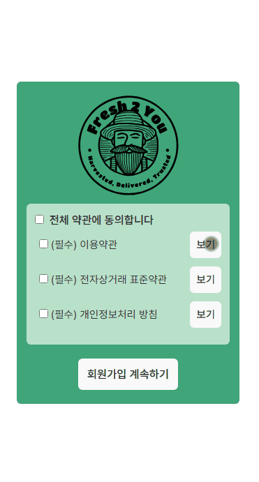</td>
    <td>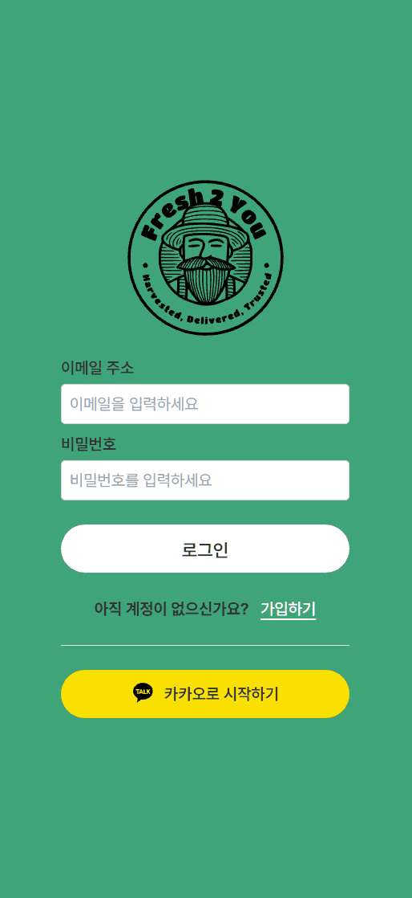</td>
    <td></td>
  </tr>
  <tr>
    <td align="center"><strong>🔍 상품 검색</strong></td>
    <td align="center"><strong>✨ 상품 추천</strong></td>
    <td align="center"><strong>📦 상품 상세 조회</strong></td>
  </tr>
  <tr>
    <td>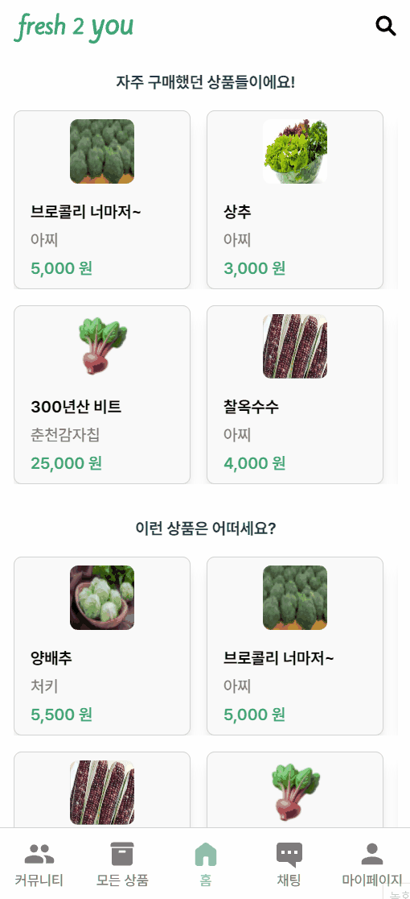</td>
    <td>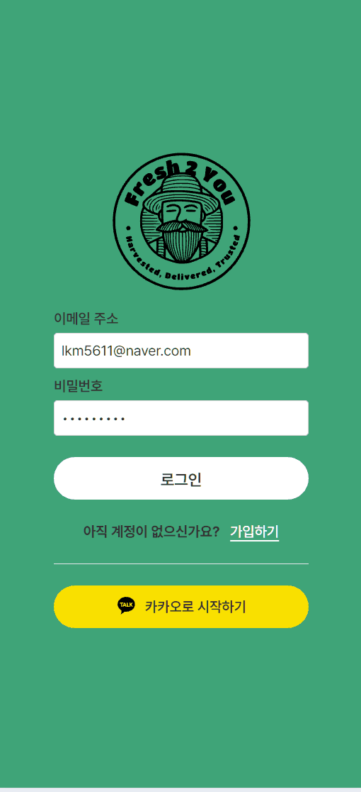</td>
    <td>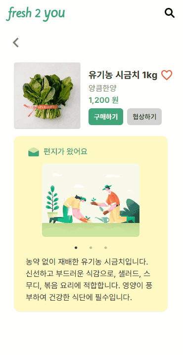</td>
  </tr>
  <tr>
    <td align="center"><strong>🛒 상품 구매</strong></td>
    <td align="center"><strong>📝 상품 등록</strong></td>
    <td align="center"><strong>✅ 판매자 인증</strong></td>
  </tr>
  <tr>
    <td>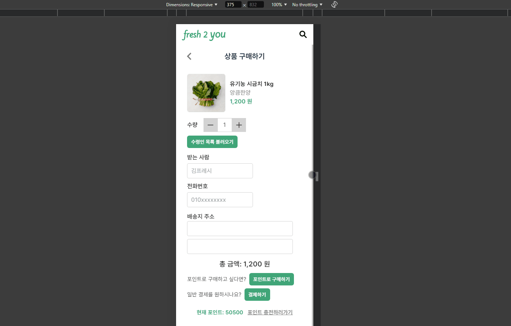</td>
    <td>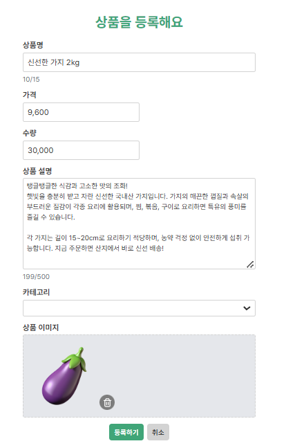</td>
    <td>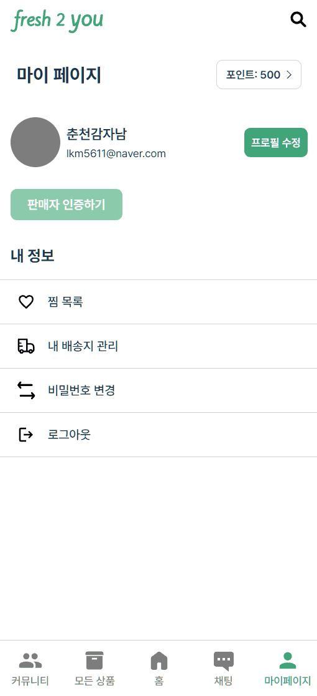</td>
  </tr>
    <tr>
    <td align="center"><strong>💰 포인트 시스템</strong></td>
    <td align="center"><strong>👤 프로필 수정</strong></td>
    <td align="center"><strong>🚚 배송지 관리</strong></td>
  </tr>
  <tr>
    <td>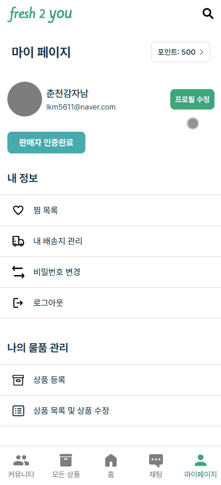</td>
    <td>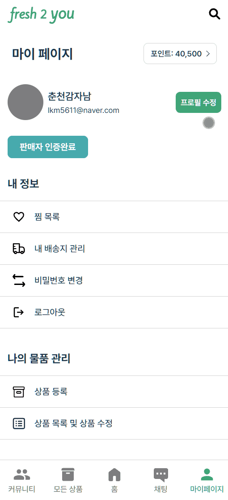</td>
    <td>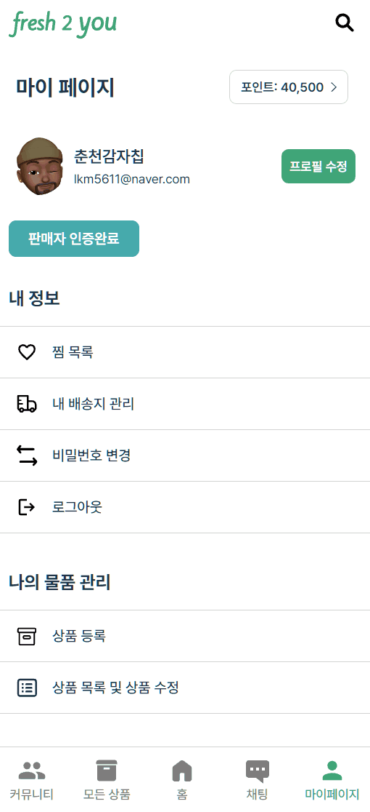</td>
  </tr>
</table>
